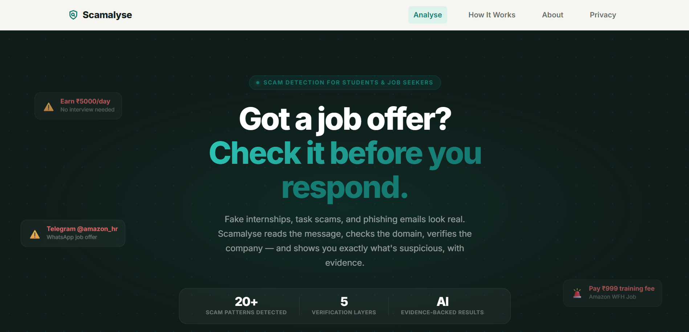
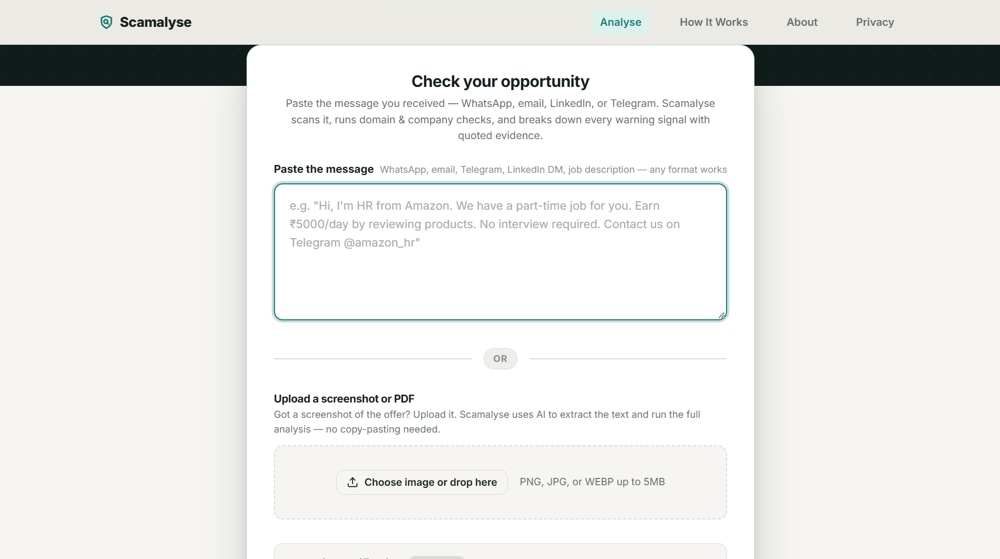
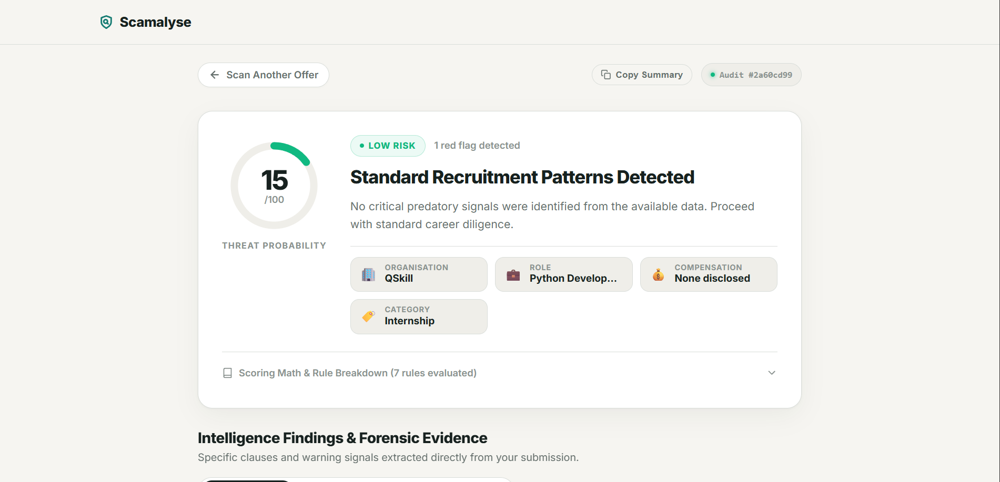
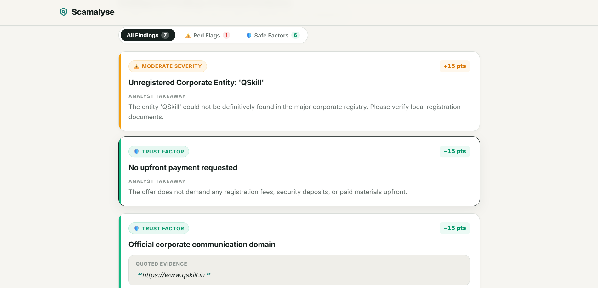
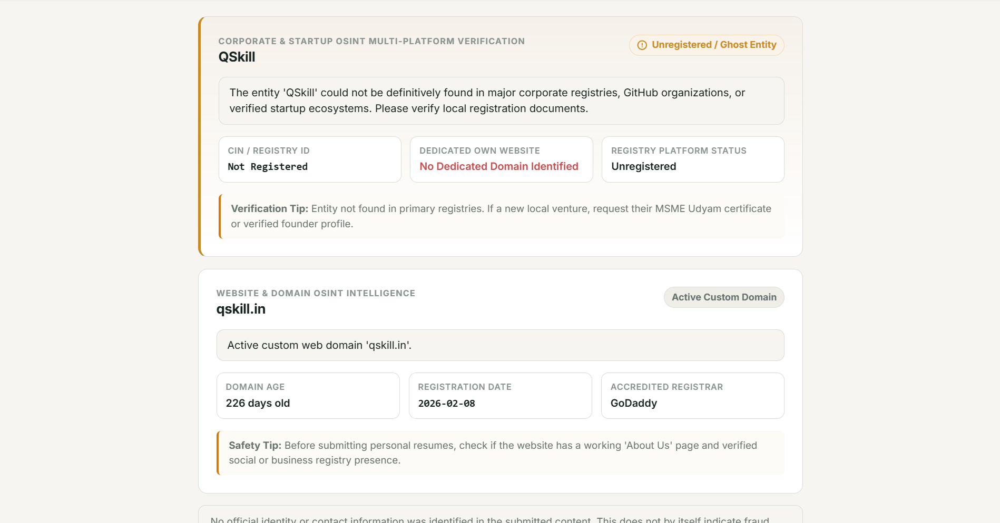

<div align="center">

# 🛡️ Scamalyse

**AI-powered internship & job offer scam detector for India.**  
Paste any suspicious offer — Scamalyse runs it through a 5-layer forensic pipeline and returns a risk score, evidence trail, and action plan in seconds.

[](https://python.org)
[](https://fastapi.tiangolo.com)
[](https://react.dev)
[](https://vitejs.dev)
[](https://ai.google.dev)
[](backend/tests)
[](LICENSE)

</div>

---

## 🌐 Live Demo

> 🚀 **Main Live Link:** [https://scamalyse.vercel.app](https://scamalyse.vercel.app) *(paste your deployed host link here)*

---

## What is Scamalyse?

Every year, thousands of students and fresh graduates in India lose money to fake internship and job offers — fake companies, upfront "security deposits", task-completion scams, and phishing links disguised as career opportunities.

Scamalyse is a forensic analysis tool that catches these scams **before** you apply. Submit any offer message (text, screenshot, or PDF) and the engine:

1. **Redacts** your personal data before it ever leaves your device.
2. **Extracts** structured facts using Google Gemini Vision AI.
3. **Verifies** the company against MCA (India), GitHub, Wellfound, Y Combinator, and ProductHunt.
4. **Inspects** the email domain (MX records, disposable check, brand impersonation) and website (WHOIS age, DNS, typosquatting).
5. **Scores** the offer on a calibrated 0–100 risk scale using 26 deterministic fraud rules.

---

## Features

| Feature | Details |
| :--- | :--- |
| 📄 **OCR / Vision** | Upload a screenshot, PDF, or image — Gemini Flash extracts text automatically |
| 🔒 **PII Redaction** | Strips emails, phone numbers, UPI IDs, Aadhaar, PAN, card numbers before AI processing |
| 🏢 **Corporate OSINT** | Verifies company via MCA master data, GitHub Orgs API, Wellfound, Y Combinator, ProductHunt |
| 📧 **Email Verification** | Live DNS MX lookup, free webmail detection, brand impersonation check |
| 🌐 **Domain Inspection** | WHOIS domain age, registrar, new-domain-for-old-brand detection, typosquatting |
| ⚖️ **Risk Engine** | 26 fraud rules (R01–R26) + 10 trust signals (S01–S10), calibrated 10/15/20/30-point tiers |
| 🧩 **Chrome Extension** | Scan any job page or paste directly from LinkedIn / WhatsApp / email |
| 🗄️ **Response Cache** | SHA-256 deduplication cache in SQLite — identical requests return instantly |
| 💬 **Feedback Loop** | Users can flag false positives / negatives to improve future accuracy |

---

## 📸 Screenshots

<div align="center">

### 1. Hero & Forensic Scanner
*Modern dark-mode interface introducing the 5-layer forensic engine and threat telemetry.*  
<br/>


<br/><br/>

### 2. Job Offer Submission Form
*Analyze offer messages by pasting text or uploading screenshots, images, and PDF offer letters.*  
<br/>


<br/><br/>

### 3. Risk Assessment & Threat Probability
*Deterministic 0–100 threat score gauge, risk level classification, and extracted role metadata.*  
<br/>


<br/><br/>

### 4. Forensic Evidence & Rule Findings
*Transparent audit trail highlighting flagged scam clauses (+pts) alongside verified trust factors (-pts).*  
<br/>


<br/><br/>

### 5. Multi-Platform OSINT & Domain Intelligence
*Live company registry verification (MCA, GitHub, Wellfound, YC) and domain WHOIS/DNS security analysis.*  
<br/>


</div>

---

## 5-Layer Forensic Pipeline

```
User Input (Text / Screenshot / PDF)
         │
         ▼
  ┌──────────────┐
  │  Layer 1     │  Privacy Redaction — strip all PII with regex (10 formats)
  └──────┬───────┘
         ▼
  ┌──────────────┐
  │  Layer 2     │  Gemini AI — OCR, semantic fact extraction, structured schema
  └──────┬───────┘
         ▼
  ┌──────────────┐
  │  Layer 3     │  Corporate OSINT — MCA, GitHub, Wellfound, YC, ProductHunt
  └──────┬───────┘
         ▼
  ┌──────────────┐
  │  Layer 4     │  Network OSINT — DNS MX, WHOIS age, typosquatting, disposable email
  └──────┬───────┘
         ▼
  ┌──────────────┐
  │  Layer 5     │  Risk Engine — 26 rules, calibrated scoring, 0–100 risk score
  └─────────────┘
```

**Risk Score Bands:**
| Score | Level | What it means |
| :--- | :--- | :--- |
| 0 – 19 | 🟢 LOW RISK | Standard recruitment language. Proceed with normal caution. |
| 20 – 49 | 🟡 MODERATE RISK | Warning signals found. Verify claims independently before engaging. |
| 50 – 69 | 🔴 HIGH RISK | Multiple serious fraud indicators. Extreme caution advised. |
| 70 – 100 | 🚨 VERY HIGH RISK | Strong evidence of a scam. Do not engage or pay anything. |

---

## Project Structure

```
Scamalyse/
├── backend/                        # Python FastAPI backend
│   ├── app/
│   │   ├── api/routes/             # REST endpoints (analyze, health, feedback)
│   │   ├── core/config.py          # Settings, API key management
│   │   ├── db/                     # SQLAlchemy session & models (cache, feedback)
│   │   ├── models/                 # Pydantic risk models
│   │   ├── schemas/                # API request/response schemas + Gemini schema
│   │   └── services/
│   │       ├── redaction_service.py    # Layer 1 — PII redaction
│   │       ├── gemini_service.py       # Layer 2 — AI OCR & extraction
│   │       ├── corporate_registry.py   # Layer 3 — Corporate OSINT
│   │       ├── email_domain_verifier.py# Layer 4 — Email & DNS verification
│   │       ├── domain_inspector.py     # Layer 4 — Website & WHOIS inspection
│   │       ├── risk_engine.py          # Layer 5 — Deterministic risk scoring
│   │       └── web_scraper.py          # Deep OSINT — live website content scraping
│   ├── tests/                      # 73 pytest unit tests (all passing)
│   ├── requirements.txt            # Python dependencies
│   ├── run.py                      # Startup script: python run.py (port 8000 / $PORT)
│   ├── Procfile                    # Web process: python run.py
│   └── .env.example
│
├── frontend/                       # React + Vite web app
│   ├── src/
│   │   ├── components/             # All UI components (AnalyseForm, RiskAssessment, etc.)
│   │   ├── data/mockData.js        # Demo data for local development
│   │   └── services/api.js         # API client layer
│   ├── extension/                  # Chrome Extension (Manifest V3)
│   │   ├── manifest.json
│   │   ├── popup.html
│   │   ├── popup.css
│   │   └── popup.js
│   ├── package.json
│   └── vite.config.js
│
├── Screenshots/                    # Application UI screenshots
│   ├── 01_hero_landing.png
│   ├── 02_analyse_form.png
│   ├── 03_threat_score_overview.png
│   ├── 04_evidence_findings.png
│   └── 05_osint_verification.png
│
├── LICENSE                         # MIT License (Srivel, 2026)
├── .env.example                    # Template — copy to backend/.env and fill in keys
├── .gitignore
└── README.md
```

---

## Getting Started (Local Development)

### Prerequisites
- Python 3.11+
- Node.js 18+
- A **Google AI Studio** API key → [Get one free here](https://aistudio.google.com/app/apikey)

### 1. Clone the repository

```bash
git clone https://github.com/Srivel33/Scamalyse.git
cd Scamalyse
```

### 2. Backend setup

```bash
cd backend

# Create and activate virtual environment
python -m venv venv
venv\Scripts\activate          # Windows
# source venv/bin/activate     # macOS / Linux

# Install dependencies
pip install -r requirements.txt

# Configure secrets
copy .env.example .env         # Windows
# cp .env.example .env         # macOS / Linux
# Open .env and fill in your GEMINI_API_KEY

# Start the API server
python run.py
# → API runs at http://127.0.0.1:8000
# → Swagger UI at http://127.0.0.1:8000/docs
```

### 3. Frontend setup

```bash
cd frontend
npm install
npm run dev
# → App runs at http://localhost:5173
```

### 4. Run the test suite

```bash
cd backend
python -m pytest
# → 73 tests, all passing
```

---

## Environment Variables

Copy `backend/.env.example` to `backend/.env` and fill in your values.

| Variable | Required | Description |
| :--- | :--- | :--- |
| `GEMINI_API_KEY` | ✅ Yes | Primary Google Gemini API key |
| `GEMINI_API_KEY1` | Optional | Failover key (auto-rotated on quota error) |
| `GEMINI_API_KEY2` | Optional | Second failover key |
| `GEMINI_MODEL` | Optional | Model name, default: `gemini-2.5-flash` |
| `DATABASE_URL` | Optional | PostgreSQL URL for production (defaults to SQLite) |

---

## Chrome Extension (Scamalyse Shield)

Located in `frontend/extension/`. Loads as a **Manifest V3** Chrome extension.

**To install locally:**
1. Open Chrome → `chrome://extensions`
2. Enable **Developer Mode** (top-right toggle)
3. Click **Load Unpacked** → select the `frontend/extension/` folder
4. The shield icon appears in your toolbar

**Features:**
- Paste any suspicious message directly into the popup
- Scan the **active browser tab** (LinkedIn job page, email, etc.)
- See risk score, warning badges, and evidence instantly
- Copy the full report summary to clipboard

---

## Deployment

| Component | Platform | Configuration & Startup Command |
| :--- | :--- | :--- |
| **Backend** | [Render.com](https://render.com) | Root dir: `backend`, Build: `pip install -r requirements.txt`, Start: `python run.py` |
| **Frontend** | [Vercel](https://vercel.com) | Root dir: `frontend`, Build: `npm run build`, env: `VITE_API_BASE_URL` |
| **Database** | SQLite (default) or [Neon.tech](https://neon.tech) PostgreSQL | Set `DATABASE_URL` env var on Render for Postgres |

---

## API Reference

Base URL: `http://127.0.0.1:8000` (local) or your Render deployment URL.

| Method | Endpoint | Description |
| :--- | :--- | :--- |
| `GET` | `/api/v1/health` | Health check — confirm API is alive |
| `POST` | `/api/v1/analyze` | Main analysis endpoint (multipart/form-data) |
| `POST` | `/api/v1/extract-text` | OCR only — extract text from image/PDF |
| `POST` | `/api/v1/feedback` | Submit feedback on an analysis result |

Full interactive documentation is available at `/docs` (Swagger UI) when the server is running.

---

## Contributing

Pull requests are welcome. For major changes, please open an issue first to discuss what you'd like to change.

1. Fork the repository
2. Create your feature branch: `git checkout -b feature/my-feature`
3. Commit your changes: `git commit -m 'feat: add my feature'`
4. Push to the branch: `git push origin feature/my-feature`
5. Open a Pull Request

Please make sure all 73 tests pass (`python -m pytest`) before submitting.

---

## License

MIT © 2026 Srivel — see [LICENSE](LICENSE) for details.

---

<div align="center">
  <sub>Built with ❤️ to protect students and job seekers from recruitment fraud.</sub>
</div>

